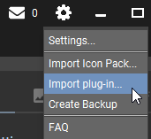
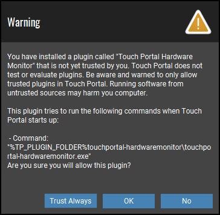
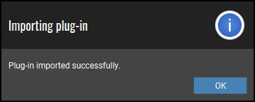
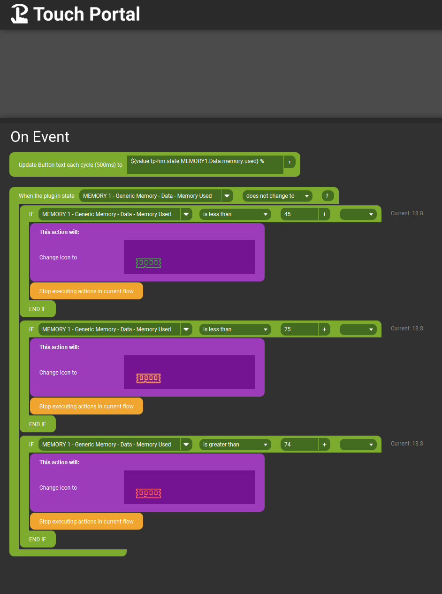
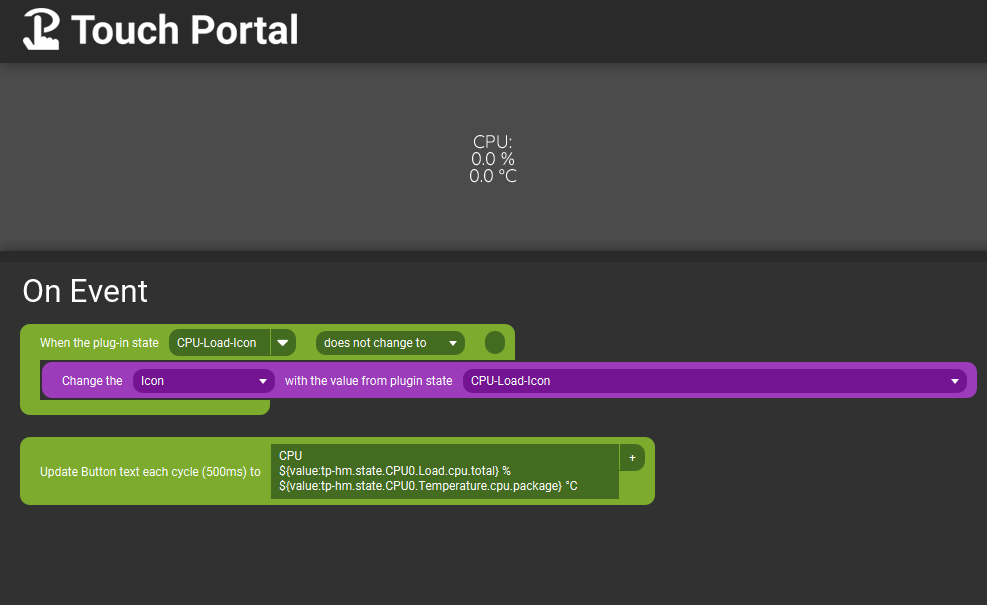
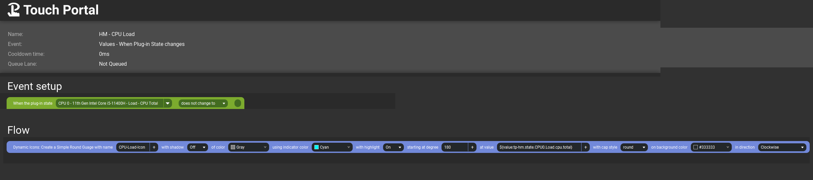

# Touch Portal Hardware Monitor

[](https://github.com/spdermn02/TouchPortal-HardwareMonitor/releases)
[](https://github.com/spdermn02/TouchPortal-HardwareMonitor/releases)
[](LICENSE)


Turn your PC's live hardware sensors — **CPU, GPU, RAM, storage, network, motherboard** — plus **display refresh rate** and **game FPS** into auto-created Touch Portal states you can drop onto any button or page.

> [!NOTE]
> **Version 2.x is a complete rewrite in C# / .NET 10.** LibreHardwareMonitor is now **built in** — you no longer install or run it (or Open Hardware Monitor) separately. It ships as a single self-contained `.exe`.
> Looking for the legacy Node.js v1.x docs? See **[README-v1.X.md](README-v1.X.md)**.

---

## ✨ Features

- 🧩 **Self-contained** — one trimmed, single-file `.exe`. No Node.js, no separate hardware-monitor app, nothing else to install.
- 🔌 **LibreHardwareMonitor built in** (LibreHardwareMonitorLib 0.9.6) — sensors read directly, in-process, not over WMI.
- 🛡️ **Runs elevated** — a small launcher requests UAC so MSR/SuperIO sensors (CPU temps, clocks, voltages, motherboard, fans) are actually readable.
- 📊 **Auto-created states for every sensor**, each with companion states:
  - `….unit` — always available (°C/°F, %, W, MHz, RPM, GB, …)
  - `….min` / `….max` — lowest/highest observed value
- 🖥️ **Display states** — refresh rate (Hz), resolution, name and primary flag per monitor. *No driver, no elevation.*
- 🎮 **FPS states** — foreground-app frame rate, with a selectable source (**RTSS / PresentMon / in-process ETW / Auto**).
- ⏱️ **Live settings** — changing the capture interval or FPS source applies immediately, no restart.
- 🔢 **Stable hardware numbering** — persistent per-device indexes saved to `%AppData%\TouchPortalHardwareMonitor`, so `CPU1`, `GPU1`, `Network1`, … keep pointing at the same device across restarts and reinstalls.
- 🧹 **Cleaner device list** — Windows network filter drivers and virtual/inactive adapters are filtered out; only hardware that reports sensors is published.
- 🩺 **Built-in diagnostics** — a sensor-access status state, elevation/driver detection, and a full JSON hardware dump for troubleshooting.

---

## 📊 What you get (states)

**Sensor states** are created dynamically for every reported sensor:

```
tp-hm.state.{TYPE}{index}.{SensorType}.{name}          e.g. tp-hm.state.CPU1.Temperature.cpu.package
tp-hm.state.{TYPE}{index}.{SensorType}.{name}.unit     e.g. tp-hm.state.CPU1.Temperature.cpu.package.unit  → "C"
tp-hm.state.{TYPE}{index}.{SensorType}.{name}.min / .max
```

`TYPE` is `CPU`, `GPU`, `MEMORY`, `STORAGE`, `NETWORK`, `MOTHERBOARD`, … and `index` is the persistent per-type number.

**Display states** (group **Displays**):

| State | Example |
|---|---|
| `tp-hm.state.display.{n}.refresh_rate` (+ `.refresh_rate.unit`) | `144` / `Hz` |
| `tp-hm.state.display.{n}.resolution` | `2560x1440` |
| `tp-hm.state.display.{n}.name` | monitor name |
| `tp-hm.state.display.{n}.primary` | `true` / `false` |
| `tp-hm.state.display.count` | `2` |

**FPS states** (group **FPS**):

| State | Example |
|---|---|
| `tp-hm.state.fps.value` (+ `.unit`) | `144` / `FPS` |
| `tp-hm.state.fps.process` | `game.exe` |
| `tp-hm.state.fps.source` | `RTSS` / `PresentMon` / `Built-in` |

**Diagnostics state** (group **TP Hardware Monitor**):

| State | Purpose |
|---|---|
| `tp-hm.state.plugin.sensor_status` | Plain-language sensor-access status (e.g. warns if the kernel driver didn't load) |

---

## 📋 Requirements

- Windows 10 / 11 (x64)
- **Administrator rights** (the plugin elevates via UAC on launch)
- Touch Portal with SDK 6
- *(Optional)* RivaTuner Statistics Server / MSI Afterburner — for the `RTSS` FPS source

---

## 📥 Installation

### Step 1 — Download
Grab the latest `TouchPortalHardwareMonitor-Windows-<version>.tpp` from the [**Releases**](https://github.com/spdermn02/TouchPortal-HardwareMonitor/releases) page.

> [!IMPORTANT]
> Upgrading from **v1.x**? Remove the old plugin first and **back up / export your pages** — hardware indexes may map to different devices in 2.x, so some buttons will need re-pointing. See [Breaking changes](#-upgrading-from-v1x).

### Step 2 — Import into Touch Portal
Click the gear icon in the Touch Portal desktop app and choose **Import plug-in…**



### Step 3 — Locate the `.tpp` and open it
Navigate to the downloaded `.tpp`, select it, and click **Open**.

### Step 4 — Trust the plugin
Select **Trust Always** so the plugin starts automatically with Touch Portal.



### Step 5 — Confirm
Click **OK**.



### Step 6 — Accept the UAC prompt
The plugin launches elevated so it can read all sensors. Accept the Windows UAC prompt when it appears. That's it — states start populating within a couple of seconds.

---

## ⚙️ Settings

| Setting | Default | Values | Notes |
|---|---|---|---|
| Sensor Capture Time (ms) | `2000` | `500`–`99999` | How often sensors are read. **Applies live.** |
| Temperature Unit (C/F) | `C` | `C` / `F` | |
| Normalize Throughput (B/s, KB/s, MB/s, GB/s) | `No` | `No` / `Yes` | Scales network throughput to a friendlier unit; adds a `.unit` state. |
| Normalize Data (MB, GB) | `No` | `No` / `Yes` | Scales SmallData (e.g. VRAM) to a friendlier unit; adds a `.unit` state. |
| **FPS Source (Off/RTSS/PresentMon/Built-in/Auto)** | `Auto` | `Off` / `RTSS` / `PresentMon` / `Built-in` / `Auto` | **Applies live.** `Auto` = RTSS if running → PresentMon → in-process ETW. `PresentMon` and `Built-in` need Admin; `Built-in` is approximate. |

> [!NOTE]
> The v1.x **"Hardware Monitor To Use"** setting is gone — LibreHardwareMonitor is embedded, so there's no external source to choose.

---

## 🎛️ Examples

> State names vary with your hardware, so treat these as inspiration.

### Memory usage
Displays used memory %, with a Green/Orange/Red icon by threshold.



### CPU usage & temperature
Shows CPU load % and temperature, combined with [Touch Portal Dynamic Icons](https://github.com/spdermn02/TouchPortal-Dynamic-Icons) for a round gauge.

Button:



Event (generates the dynamic gauge icon):



---

## 🧪 Troubleshooting: missing CPU / motherboard temperatures

If **GPU temps show up but CPU temps don't**, LibreHardwareMonitor's kernel driver (WinRing0) isn't loading. GPU (NVAPI), storage (SMART) and OS load/memory don't need it, but CPU temp/clock/voltage and motherboard sensors do. Work through these in order:

1. **Run as administrator** — accept the UAC prompt. In Task Manager → *Details*, the *Elevated* column should read **Yes** for `TouchPortalHardwareMonitor.exe`.
2. **Windows Memory Integrity** (Settings → Privacy & security → Windows Security → Device security → Core isolation) — if **On**, it blocks the driver. Turn it off and reboot. *(Security trade-off.)*
3. **Close other monitoring apps** that hold the driver (HWiNFO, MSI Afterburner/RTSS, Armoury Crate, OpenRGB, Ryzen Master), then restart.
4. **Check antivirus** for a quarantined `WinRing0` driver.

The **`tp-hm.state.plugin.sensor_status`** state summarizes this in plain language.

---

## 🩺 Diagnostics

- **Hardware dump** — drop an empty `dump_sensors.txt` next to the plugin `.exe` and restart. It writes `hardware_dump.json` with raw + converted values, units, assigned indexes, skip reasons, **elevation state**, a **sensor-access summary**, and even sensors LHM couldn't read.
- **Verbose logging** — create `loglevel.txt` containing `DEBUG` next to the `.exe` for detailed `plugin.log` output.
- **CLI probes** (run the exe directly):
  - `TouchPortalHardwareMonitor.exe --displays` — list monitors + refresh rates and exit.
  - `TouchPortalHardwareMonitor.exe --fps` — sample FPS for ~10s (run elevated, with a game open, to test the ETW backend).

---

## 🛠️ Build from source

**Prerequisites:** [.NET 10 SDK](https://dotnet.microsoft.com/download), Windows x64.

```powershell
# from the repo root
.\csharp-plugin\build.ps1
```

This publishes the self-contained plugin + launcher and packages them into `csharp-plugin\Installers\TouchPortalHardwareMonitor-Windows-<version>.tpp`, ready to import.

On first run the script also **downloads [Intel PresentMon](https://github.com/GameTechDev/PresentMon) 1.10.0** (MIT) into `csharp-plugin\tools\` (gitignored, not committed) and bundles it for the accurate FPS backend. If the download is skipped/unavailable, the plugin still builds — only the `PresentMon` FPS source is unavailable.

---

## ⚠️ Upgrading from v1.x

- **Not an in-place upgrade** — the plugin folder/executable changed. Remove the v1.x plugin, then import 2.x.
- **Hardware indexes may differ** — 2.x assigns persistent indexes on first run, so `tp-hm.state.GPU1.…` may map to a different device than in v1.x. **Re-point affected buttons.**
- **"Hardware Monitor To Use" removed** — LibreHardwareMonitor is embedded.
- **Administrator/UAC required** — declining the prompt prevents startup.

The base sensor state-ID format (`tp-hm.state.{TYPE}{index}.{SensorType}.{name}`) is unchanged; only the index→device mapping may move.

---

## 📦 Changelog

See the [Releases](https://github.com/spdermn02/TouchPortal-HardwareMonitor/releases) page for full notes. The v1.x changelog lives in [README-v1.X.md](README-v1.X.md).

- **2.x** — full C# / .NET 10 rewrite; embedded LibreHardwareMonitor; elevated launcher; `.unit`/`.min`/`.max` companion states; persistent hardware indexes; display refresh-rate states; selectable-source FPS states; live capture-interval & FPS-source settings; sensor-access diagnostics.

---

## 🔖 Versioning

We use [SemVer](http://semver.org/). See the [tags](https://github.com/spdermn02/TouchPortal-HardwareMonitor/tags) for available versions.

## 👤 Authors

- **Jameson Allen** — [Spdermn02](https://github.com/spdermn02)

## 📄 License

MIT — see [LICENSE](LICENSE).

## 🙏 Acknowledgments

- [LibreHardwareMonitor](https://github.com/LibreHardwareMonitor/LibreHardwareMonitor) for the sensor library
- Ty and Reinier for creating and developing Touch Portal
- Sora for testing
