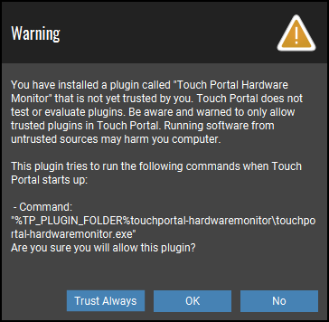
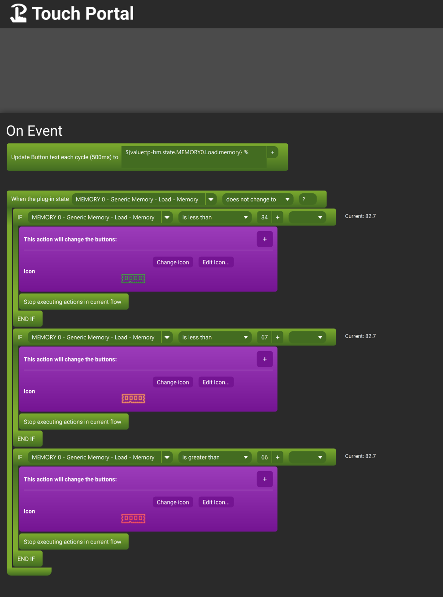

# TouchPortal HardwareMonitor

Read Data from Open Hardware Monitor or Libre Hardware Monitor, get all data from the sensors as auto created state values.

- [TouchPortal HardwareMonitor](#touchportal-hardwaremonitor)
  - [Current Sensors and Values Available](#current-sensors-and-values-available)
  - [Getting Started](#getting-started)
  - [Installing](#installing)
    - [Step 1: Prerequisites](#step-1-prerequisites)
    - [Step 2: Download Plugin](#step-2-download-plugin)
    - [Step 3: Import into Touch Portal](#step-3-import-into-touch-portal)
    - [Step 4: Locate .tpp and Open](#step-4-locate-tpp-and-open)
    - [Step 5: Select `Trust Always` on Warning Popup](#step-5-select-trust-always-on-warning-popup)
    - [Step 6: Click `OK` on Popup](#step-6-click-ok-on-popup)
    - [Step 7: Enjoy the Plugin](#step-7-enjoy-the-plugin)
  - [Settings](#settings)
  - [Examples](#examples)
    - [Display Memory Usage](#display-memory-usage)
    - [Display CPU Usage and Temperature](#display-cpu-usage-and-temperature)
  - [ChangeLog](#changelog)
  - [Build It](#build-it)
  - [Versioning](#versioning)
  - [Authors](#authors)
  - [License](#license)
  - [Acknowledgments](#acknowledgments)

## Current Sensors and Values Available

With this rewrite, all current sensor data that is available in Open Hardware Monitor or Libre Hardware Monitor is going to be made available dynamically to you as a plugin state.  The state id's themselves are fairly "generic" in regards to hardware they reference it by type of hardware not specifically the exact hardware names. So sharing pages is still possible but note that 1 cpu based computers could only utilize one portion of a page if it was created from a 2 cpu based computer. (if that makes sense)

## Getting Started
If you use Touch Portal and are interested in having a "dashboard" display of your computer statistics, these instructions will help get that setup for you.

If you don't use Touch Portal - how dare you, you should!

## Installing

### Step 1: Prerequisites

Install Open Hardware Monitor **OR** Libre Hardware Monitor if you do not have either, and make sure it is running

1) **Open Hardware Monitor** <br>
The original plugin was built to read from this program's data, so left it here for users who don't want to migrate to using Libre Hardware Monitor
https://openhardwaremonitor.org/ 

1) **Libre Hardware Monitor**<br>
Now you can read the sensor data from Libre Hardware Monitor (a fork of Open Hardware Monitor, but seems to have better support and more updates) https://github.com/LibreHardwareMonitor/LibreHardwareMonitor

### Step 2: Download Plugin
Download the Touch Portal plugin from the [Releases](https://github.com/spdermn02/TouchPortal-HardwareMonitor/releases) section of this repository

### Step 3: Import into Touch Portal
Select the Gear icon at the top of Touch Portal desktop window and select `Import plug-in...` <br><br>


### Step 4: Locate .tpp and Open
 Navigate to where you downloaded the .tpp file from Step 1, select it and click "Open"

### Step 5: Select `Trust Always` on Warning Popup
In order for this plugin to run when you start Touch Portal, you will need to select `Trust Always` on the popup that appears, if you do not do this, it will show up every time you start Touch Portal <br><br>


### Step 6: Click `OK` on Popup
Once you trust the plugin, click `OK` button <br><br>


### Step 7: Enjoy the Plugin
After the plugin imports, it will start and start reading the data by default using `root/LibreHardwareMonitor` every 2 seconds and report temperature in Celsius. See the Settings section for info on how to change these.

## Settings

There are currently 3 settings for this plugin
1) `Hardware Monitor To Use` - Which Sensor data to read
   1) Default: `root/LibreHardwareMonitor`
   2) Valid Values: `root/LibreHardwareMonitor` or `root/OpenHardwareMonitor`
2) `Sensor Capture Time (ms)` - How often to read sensor data
   1) Default: `2000`
   2) Min: 1000
   3) Max: 9999
3) `Temperature Unit (C/F)` - Which Temperature Scale to use
   1) Default: C
   2) Valid Values: `C` or `F`
4) `Normalize Throughput (B/s, KB/s, MB/s, GB/s)` - Normalize Throughput values to smaller more Visually pleasing values
   1) Default: No
   2) Valid Values: `No` or `Yes`
   3) How: This takes the throughput values and divides by 1024, until the value is less than 1024, counts how many times it does the calc to know Unit, will now create a unit based state as well for those that are converted 

## Examples

Again - the plugin-state names may be different depending on your hardware configuration from what mine are so this is purely for example of how to use it possibly

### Display Memory Usage

This button displays the current Used Percentage of the Memory and based on it's value, a Green/Orange/Red Memory Module icon - you choose your breakdown of Green/Orange/Red indicators <br><br>


### Display CPU Usage and Temperature

This button displays the current Load % and Temperature of my CPU Core.  I have combined this with (Touch Portal Dynamic Icons)[https://github.com/spdermn02/TouchPortal-Dynamic-Icons] Plugin to also show a round gauge as a visual for the CPU Load. For that generation I use an Event since I have these gauges on multiple pages <br><br>

Button:

<br><br>
Event: This generates the dynamic gauge icon


## ChangeLog
```
1.0.0 - Initial Release
1.0.1 - Bug Fixes and Update Notification addition
      - Bugs: 
         - removed some left over log messages
      - Additions:
         - added in Update Notification Process for post 1.0.1 releases
         - changed Sensor Capture Interval times to be allowed 500(ms) to 99999(ms)
      - Documentation:
         - Corrected statements about generalized states being needed to share pages
1.1.0 - Adding in a new Setting
      - Additions:
         - New Setting for Normalizing Throughput units
         - Creates new Unit state when setting set to 'Yes'
            - Divides unit by 1024 until it is less than 1024, and counts how many times it did that division to determine KB/s, MB/s, GB/s
            - new Unit state is not created if this setting is 'No' initially.
1.1.1 - Bug Fix
      - Bug:
         - Fixed the setting for where Hardware data comes from to actually use what you have in the settings, it was accidentally left as Hardcoded to LHM instead of allowing it to be overridden by the plugin settings value
1.1.2 - Bug Fix
      - Bug:
         - Fixed the setting for where Sensor data comes from to actually use what you have in the settings, it was accidentally left as Hardcoded to LHM instead of allowing it to be overridden by the plugin settings value
1.1.3 - Bug Fix
      - Bug: 
         - Removed useless logging left in from v1.1.2 testing
1.1.4 - Bug Fix
      - Bug:
         - Read hardware attempts multiple tries before dying.
1.1.5 - Bug Fix
      - Bug:
         - Make sure that each sensor has unique Identifier name, as some appear to use the same base name
```
## Build It
If you are looking to build it yourself instead of the pre-setup .tpp file
1) Clone the Repository
2) `npm run build` to kick off and package the binary into a .tpp file ready to import to touch portal

## Versioning

We use [SemVer](http://semver.org/) for versioning. For the versions available, see the [tags on this repository](https://github.com/spdermn02/tpohm_plugin/tags).

## Authors

- **Jameson Allen** - _Initial work_ - [Spdermn02](https://github.com/spdermn02)

## License

This project is licensed under the MIT License - see the [LICENSE](LICENSE) file for details

## Acknowledgments

- Thank you to Open Hardware Monitor/Libre Hardware Monitor for writing your statstics somewhere accessible
- Thank you to Ty and Reinier for creating and developing Touch Portal
- Thank you to Sora for testing this out for me.